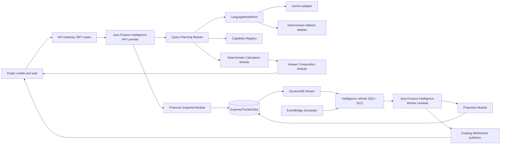

# Finance Intelligence Target Architecture

**Status:** Proposed
**Scope:** Use Cases 12 and 14-29
**Primary constraint:** The deterministic financial ledger remains the source of truth. A language model may plan queries and phrase answers, but it never calculates, infers, or mutates ledger facts.

## 1. Current Architecture Review

### Implemented and usable

- Flutter mobile/web clients with Google authentication, transaction capture, reconciliation review, analytics screens, and WebSocket reconnect support.
- Java 21 domain and application modules for transactions, reconciliation, bills, peer debt, loans, card EMIs, budgets, vendor rules, and basic financial analytics.
- Java transaction command HTTP Lambda, SQS FIFO command queue, Java command worker, and command DLQ.
- DynamoDB single-table persistence for canonical accounts, transactions, transaction commands, bills, bill reminders, and vendor rules.
- Node.js Lambda routes for legacy CRUD, Gmail scanning, basic transaction-only analytics, CSV/PDF export, and Gemini-assisted email parsing.
- API Gateway, DynamoDB, SQS, SNS, EventBridge, CloudFront, S3, Secrets Manager, CloudWatch, and WebSocket infrastructure managed by Terraform.

### Partially implemented

- Peer debt, loans, card EMIs, and budgets have Java domain/application logic but no production Java DynamoDB adapters or Java HTTP routes.
- Flutter bill, debt, loan, card-EMI, and budget state remains local and is not loaded from authoritative server state.
- The Java financial analytics module exists but is not exposed through deployed Java routes.
- Bill reminder and statement webhook handlers exist, but their complete scheduled/event infrastructure is not provisioned.
- WebSocket delivery exists, but current recovery reloads only a subset of the user's financial state.

### Intelligence gap

Use Cases 14-29 are not implemented. There is currently no:

- multi-period benchmark or trend module;
- recurring commitment model;
- confirmed income model;
- cash-flow forecast;
- goal or scenario model;
- unified debt or net-worth calculation;
- health-score model;
- proactive insight or risk pipeline;
- evidence and calculation envelope;
- financial context store;
- natural-language finance query planner;
- conversation state or capability registry.

### Existing work that must remain authoritative

The intelligence backlog must build on, not duplicate, the following open foundation issues:

- #61 - production DynamoDB adapters;
- #63 - gateway-owned identity and CORS;
- #64 - canonical Java transaction reads and review commands;
- #52 - durable peer debt;
- #53 - durable loan and card-EMI schedules;
- #54 - server-authoritative budgets;
- #41 - credit-card statement ingestion and maintenance (with the completed #55 lifecycle work retained as a prerequisite);
- #65 - bounded ingestion workers;
- #66 - persisted WebSocket synchronization;
- #59 - production readiness gates;
- #68 - retirement of legacy Node routes after Java parity.

## 2. Intelligence Use-Case Review

The use cases correctly establish the most important invariant: AI is an intelligence layer over a deterministic ledger. They also correctly require result classification, uncertainty, source evidence, correctability, non-persistent scenarios, and explicit financial memory.

The target architecture must resolve these hidden prerequisites:

1. **Confirmed income:** Forecasts, savings rate, fixed-cost ratio, and debt-to-income calculations need an explicit `IncomeSource`; arbitrary credit transactions cannot silently count as income.
2. **Point-in-time data:** Every result needs an `asOf` timestamp, timezone, included accounts, currency policy, and data-freshness information.
3. **Assets and valuation:** Net worth needs an explicit manual asset model. Investment market data remains a separate optional track.
4. **Calculation versioning:** Every derived result needs a formula identifier and version so historical snapshots remain explainable after formulas change.
5. **Recalculation scope:** Corrections need dependency-aware invalidation and bounded background recomputation.
6. **Ambiguity policy:** Entity and period resolution must return candidates when confidence is insufficient rather than silently guessing.
7. **Capability discovery:** The conversational module must know which calculations are available and whether enough source data exists.
8. **Provider privacy:** A hosted model must not receive raw transactions, account identifiers, contact names, or immutable ledger records.

## 3. Architectural Principles

1. **Deterministic calculations:** Monetary values are produced only by pure Java domain calculators.
2. **Explainability by construction:** Every calculator returns an `IntelligenceResult<T>` containing its value and evidence; explainability is not retrofitted later.
3. **Read-only intelligence:** Query and scenario interfaces receive read-only snapshots. Explicit corrections use existing domain commands and audit their effects.
4. **Provider-neutral language model:** The application depends on a `LanguageModelPort`, never a provider SDK.
5. **Graceful no-model operation:** Common queries and all dashboards work through deterministic parsing and templates when the hosted model is unavailable or over budget.
6. **Single-table persistence:** New records use sort-key prefixes in `ExpenseTrackerData`; no intelligence-specific DynamoDB table is introduced.
7. **Eventual projections, current ledger:** Persisted insights and snapshots may update asynchronously, but direct factual queries read the current ledger snapshot.
8. **Single-user simplicity:** Do not introduce a vector database, Knowledge Base, AgentCore, Kubernetes, RDS, or Step Functions until a measured requirement justifies one.

## 4. Target Modules and Interfaces

### 4.1 Financial Snapshot Module

**Interface:** `LoadFinancialSnapshotUseCase`

Loads a point-in-time, read-only view containing:

- accounts and balances;
- canonical transactions;
- budgets;
- bills and recurring commitments;
- peer debt;
- loans and card EMIs;
- confirmed income;
- goals;
- manual assets;
- active financial context.

The interface hides DynamoDB access patterns, pagination, stale records, and legacy item formats from every calculator.

### 4.2 Calculation Module

**Interface:** `EvaluateFinancialCapabilityUseCase`

Input:

- a typed `FinancialCapability`;
- validated filters;
- a `FinancialSnapshot`;
- an optional scenario override.

Output:

```text
IntelligenceResult<T>
  value
  resultType
  asOf
  formulaId
  formulaVersion
  sourceCount
  sourceReferences
  filters
  comparisonBaseline
  assumptions
  confidence
  dataFreshness
  warnings
```

Implementations remain pure Java and cover:

- spending summaries and trends;
- recurring commitments;
- cash-flow forecasts;
- budget forecasts;
- debt position and payoff comparisons;
- goals and scenarios;
- net worth;
- health score;
- anomalies and proactive insights.

### 4.3 Capability Registry Module

**Interface:** `ListFinancialCapabilitiesUseCase`

Each capability declares:

- required source data;
- supported filters;
- minimum history;
- whether it can produce facts, derived insights, predictions, or recommendations;
- the calculator responsible for it;
- a user-facing limitation when requirements are not met.

The language model can only select registered capabilities.

### 4.4 Query Planning Module

**Interface:** `PlanFinanceQueryUseCase`

The module first applies deterministic resolution for dates, known merchants, accounts, contacts, loans, and common query patterns. If the query remains unclear, it invokes `LanguageModelPort.plan(...)` with:

- a tokenized or redacted user question;
- the capability schemas;
- opaque candidate identifiers;
- non-sensitive conversation filters.

The returned plan is schema-validated and rejected if it references an unknown capability, field, identifier, or operation.

### 4.5 Answer Composition Module

**Interface:** `ComposeFinanceAnswerUseCase`

The default adapter renders deterministic answer templates from `IntelligenceResult` values. An optional hosted-model adapter may improve phrasing using only the structured result envelope. It cannot add amounts, causes, recommendations, or source references absent from that envelope.

### 4.6 Scenario Module

**Interface:** `EvaluateFinancialScenarioUseCase`

Creates an immutable, request-scoped overlay on a `FinancialSnapshot`. The module has no write port and cannot persist a scenario. Converting a scenario into a goal or commitment is a separate explicit command.

### 4.7 Projection Module

**Interface:** `RefreshFinancialProjectionsUseCase`

Updates persisted read models and proactive records idempotently after source data changes. It writes only derived prefixes such as insights, alerts, and snapshots; it cannot write canonical transaction or obligation records.

### 4.8 Correction and Audit Module

**Interface:** `CorrectFinancialRecordUseCase`

Delegates the correction to the existing authoritative domain command, appends an immutable audit record, determines affected capability-period pairs, recalculates the current period, and queues bounded historical recalculation.

## 5. Runtime Topology



Only two intelligence Lambdas are required:

- **Finance Intelligence API Lambda:** all synchronous intelligence and conversational routes;
- **Finance Intelligence Worker Lambda:** projections, scheduled analysis, and recalculation jobs.

The existing transaction command queue remains isolated from intelligence work so slow analysis cannot delay financial commands.

## 6. DynamoDB Access Patterns

All records remain under `PK = USER#<UserId>`.

| Record | Sort-key pattern |
|---|---|
| Confirmed/inferred income source | `INCOME#<IncomeSourceId>` |
| Financial context item | `CONTEXT#<ContextItemId>` |
| Recurring commitment | `RECUR#<CommitmentId>` |
| Financial goal | `GOAL#<GoalId>` |
| Manual asset | `ASSET#<AssetId>` |
| Proactive insight | `INSIGHT#<CreatedAt>#<InsightId>` |
| Risk alert | `ALERT#<CreatedAt>#<AlertId>` |
| Net-worth snapshot | `NETWORTH#<AsOf>` |
| Health-score snapshot | `HEALTH#<AsOf>` |
| Conversation session | `CONVERSATION#<SessionId>` |
| Conversation turn | `TURN#<SessionId>#<CreatedAt>` |
| Intelligence audit entry | `AUDIT#<CreatedAt>#<AuditId>` |
| Recalculation job state | `INTEL_JOB#<JobId>` |

Conversation and transient job records use DynamoDB TTL. Derived records include `formulaId`, `formulaVersion`, `asOf`, and source-version information.

The DynamoDB stream uses `NEW_AND_OLD_IMAGES`. Its event-source filter admits canonical financial prefixes and rejects derived intelligence prefixes, preventing projection loops. The worker is idempotent because DynamoDB Streams and SQS both provide at-least-once delivery.

## 7. Language-Model Provider Strategy

### Decision

Use a provider-neutral `LanguageModelPort` with:

1. **paid Gemini Developer API adapter as the first production hosted adapter;**
2. **deterministic parser/template adapter as the mandatory fallback;**
3. **Vertex AI Gemini as an optional adapter for consuming eligible Google Cloud credits;**
4. additional adapters only after a measured reliability, privacy, or cost need.

There is no Bedrock dependency and no need for an agent platform or vector database.

### Gemini deployment modes

| Mode | Intended use | Data handling |
|---|---|---|
| Gemini Developer API unpaid quota | Development with synthetic or strictly redacted data | Google states unpaid content may be used to improve products and may be human reviewed |
| Gemini Developer API paid tier | Simplest production integration from AWS | Google states paid prompts and responses are not used to improve products; Google Cloud Welcome credit does not pay these charges |
| Gemini on Vertex AI | Production when using eligible Google Cloud credits | Google Cloud billing and Vertex AI IAM apply; use AWS-to-Google Workload Identity Federation rather than a long-lived service-account key |
| No hosted model | Provider outage, quota exhaustion, or privacy lock | Deterministic parsing and response templates |

Google AI Pro, Gemini Developer API billing, and Google Cloud Welcome credit are separate programs. The user's $300 Google Cloud Welcome credit can cover eligible Google Cloud services, including Gemini through Vertex AI, but not Gemini Developer API paid-tier charges in Google AI Studio. The Welcome credit is temporary: it expires 90 days after Free Trial signup, and any remaining credit does not create a permanent free allowance.

Keep the application-facing port independent of both Gemini endpoints. The existing Gemini Developer API integration remains the lowest-complexity path, while a Vertex AI adapter can consume the Welcome credit without changing domain or application services. Do not introduce Vertex AI solely to optimize a temporary credit unless its additional cross-cloud IAM and operational setup is acceptable.

For the hosted adapter:

- use a current Flash model selected through configuration rather than a `*-latest` alias;
- use structured output for query plans;
- enforce strict timeouts, output-token limits, and schema validation;
- retain conversation state in the application's DynamoDB table;
- do not rely on provider-owned conversation memory;
- send no raw transactions, contact names, account identifiers, email bodies, or complete financial snapshots;
- log token counts and provider metadata, never prompt or completion content;
- stop hosted calls when the configurable monthly budget is reached, with a $5 single-user default.

## 8. Cost Position

The deterministic engine is suitable for a single-user serverless workload and should remain inside or close to recurring free allowances for Lambda, SQS, DynamoDB Streams, EventBridge Scheduler, and CloudWatch. The existing DynamoDB `PAY_PER_REQUEST` mode, API Gateway after promotional allowances, Secrets Manager, S3/CloudFront, and hosted model calls mean a permanent exact-zero bill is not guaranteed.

The recommended cost policy is:

- retain `PAY_PER_REQUEST` until measured usage justifies provisioned capacity;
- avoid scans by loading paginated snapshots and storing monthly projections;
- run daily rather than high-frequency scheduled analysis;
- invoke the hosted model only when deterministic parsing cannot resolve the query;
- use deterministic answer templates by default;
- set provider and AWS budget alarms before enabling production traffic.

For a single user, the $300 Google Cloud Welcome credit should provide ample temporary runway for a modest Vertex AI Gemini workload. It does not make the architecture permanently free and should not be counted as recurring funding. If the simpler Gemini Developer API is used instead, its own free quota or separately funded paid balance applies.

## 9. Dependency-Ordered GitHub Issue Draft

The issues below are full-stack vertical slices. Each includes domain logic, an inbound interface, required outbound ports/adapters, existing-table access patterns, Terraform changes, Flutter loading/empty/error states, public-seam tests, and Playwright browser E2E. No issue is documentation-only.

| Issue | Title | Depends on |
|---|---|---|
| #70 | Deliver explainable Java spending analytics and evidence drill-down | #61, #63, #64 |
| #71 | Deliver explicit financial context management | #61, #63 |
| #72 | Deliver confirmed income-source management and income suggestions | #61, #63, #64 |
| #73 | Deliver provider-neutral conversational spending queries with Gemini and deterministic fallback | #70, #71 |
| #74 | Deliver event-driven proactive spending insights | #70, #65, #66 |
| #75 | Deliver recurring commitment detection and confirmation | #70, #72, #41, #53 |
| #76 | Deliver explainable cash-flow forecasting and minimum-balance risks | #71, #72, #75, #41, #53 |
| #77 | Deliver budget pace forecasting and driver explanations | #70, #76, #54 |
| #78 | Deliver unified debt position and payoff comparisons | #70, #41, #52, #53 |
| #79 | Deliver financial goals and contribution projections | #76 |
| #80 | Deliver non-persistent financial scenario analysis | #76, #77, #78, #79 |
| #81 | Deliver manual assets, net-worth calculation, and snapshots | #78 |
| #82 | Deliver financial anomaly and risk detection | #74, #75, #76, #77, #64 |
| #83 | Deliver transparent financial health scoring and drivers | #72, #75, #76, #77, #78, #79, #81 |
| #84 | Deliver correction audit and dependency-aware recalculation | #74, #77, #82, #83, #64 |
| #85 | Deliver multi-turn "Ask My Finances" and capability-aware degradation | #71, #73, #74, #75, #76, #77, #78, #79, #80, #81, #82, #83, #84, #66 |
| #86 | Deliver investment intelligence and market-data freshness disclosures | #80, #81; optional release |

### Delivery waves

1. **Foundation gate:** Complete #61, #63, and #64. Continue #41, #52, #53, #54, #65, and #66 in parallel.
2. **Intelligence foundation:** #70, #71, and #72 can proceed in parallel after their listed gates.
3. **Early conversational proof:** #73 proves the provider seam using spending queries before the composite intelligence modules exist.
4. **State and projection modules:** #74, #75, and #78 can proceed in parallel when their dependencies are complete.
5. **Planning modules:** #76, #77, #79, #80, and #81 follow their data dependencies.
6. **Composite intelligence:** #82, #83, and #84.
7. **Unified experience:** #85.
8. **Optional investment track:** #86.

## 10. Definition of Done for Every Intelligence Issue

An intelligence issue cannot close until:

1. the pure domain calculation or entity behavior is tested through a public application interface;
2. the Java application interface and implementation are wired to production adapters;
3. all persistence uses `ExpenseTrackerData` with documented key patterns and idempotent writes;
4. Terraform provisions every route, permission, trigger, queue, DLQ, schedule, secret reference, alarm, and configuration value required by the slice;
5. Flutter uses live server state and handles loading, empty, stale, insufficient-data, and error states;
6. facts, derived insights, predictions, and recommendations are visibly distinguished;
7. calculation evidence and source-record drill-down are available;
8. no hosted model performs arithmetic or receives raw financial records;
9. targeted backend, adapter, Flutter, and deployed integration tests pass;
10. Playwright verifies live rendering, interaction, navigation, and API integration;
11. every acceptance criterion in the GitHub issue is explicitly checked before closure.
