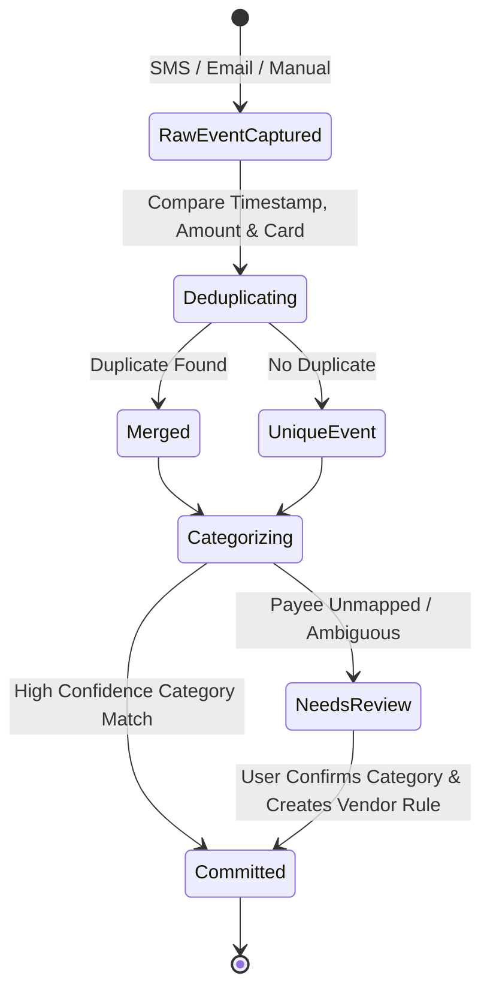

# Automatic Expense Tracker — Domain Definition Document

## 1. Domain Overview & Bounded Context
This document defines the ubiquitous domain language, core entities, value objects, domain rules, and state transitions for the **Personal Financial Management Bounded Context**. The domain models a single user's financial lifecycle across multiple financial accounts, credit card bills, recurring loans, peer debt relationships, and automated transaction ingestion channels.

---

## 2. Ubiquitous Language & Glossary

* **Transaction**: A canonical record of money moving into (credit) or out of (debit) an account.
* **Transaction Event**: A raw, un-reconciled data payload received from an external channel (`SMS`, `Email`, `Manual`).
* **Ingestion Channel**: The medium through which financial evidence is captured (`Mobile_SMS`, `Email_Push`, `Manual_Entry`).
* **Financial Account**: A financial container owned or used by the user (`Bank_Account`, `Credit_Card`, `Digital_Wallet`, `Cash`).
* **Deduplication**: Domain logic that identifies when an `SMS` event and an `Email` event describe the same physical purchase and merges them into a single `Transaction`.
* **Category & Subcategory**: A two-tier hierarchical classification system (`ParentCategory > Subcategory`) assigned to transactions for budgeting and analytics.
* **Vendor Mapping Rule**: A learned domain association mapping a raw payee pattern (e.g. `saira banu`) to a canonical category (e.g. `Food & Dining > Tea & Snacks`) and optional vendor nickname.
* **Bill Statement**: A periodic statement generated by a card issuer or lender detailing a statement balance, minimum payment due, and due date.
* **Peer Debt Ledger**: An informal record tracking money lent to or borrowed from personal contacts (friends, family, colleagues).
* **Expense Split**: The division of a single transaction among multiple contacts, allocating specific shares as peer debt while reducing the user's net personal expense.
* **Loan & EMI Plan**: A formal debt schedule tracking principal amount, interest rate, tenure, monthly EMI payments, and remaining balance.

---

## 3. Core Entities & Value Objects

### 3.1. Transaction (Entity)
* **Identity**: `TransactionId`
* **Attributes**:
  * `amount`: Monetary Value & Currency
  * `type`: Enum (`DEBIT`, `CREDIT`)
  * `timestamp`: Date & Time
  * `merchantName`: String (Raw and Cleaned)
  * `accountId`: Reference to Account
  * `categoryId`: Reference to Category
  * `ingestionSource`: Enum (`SMS`, `EMAIL`, `MANUAL`)
  * `reconciliationStatus`: Enum (`AUTO_MERGED`, `CONFIRMED`, `NEEDS_REVIEW`)
  * `netPersonalExpense`: Monetary Value (Adjusted for splits/lending)

### 3.2. Financial Account (Entity)
* **Identity**: `AccountId`
* **Attributes**:
  * `name`: String (e.g. "HDFC Salary Account", "SBI Credit Card")
  * `type`: Enum (`SAVINGS`, `CHECKING`, `CREDIT_CARD`, `WALLET`, `CASH`)
  * `lastFourDigits`: String (e.g. `1234`)
  * `currency`: Currency Code (e.g. `INR`, `USD`)
  * `currentBalance`: Monetary Value

### 3.3. Bill Statement (Entity)
* **Identity**: `BillId`
* **Attributes**:
  * `accountId`: Reference to Credit Card / Lender Account
  * `statementBalance`: Monetary Value
  * `minimumAmountDue`: Monetary Value
  * `dueDate`: Date
  * `status`: Enum (`PENDING`, `PAID`, `OVERDUE`)
  * `settledTransactionId`: Optional Reference to Payment Transaction

### 3.4. Peer Debt Entry (Entity)
* **Identity**: `DebtId`
* **Attributes**:
  * `contactName`: String (e.g. "Rahul", "Priya")
  * `contactIdentifier`: Optional Contact Phone/Email
  * `type`: Enum (`LENT_TO_PEER`, `BORROWED_FROM_PEER`)
  * `originalAmount`: Monetary Value
  * `outstandingBalance`: Monetary Value
  * `status`: Enum (`ACTIVE`, `SETTLED`)
  * `linkedTransactionIds`: List of Transaction References

### 3.5. Loan Account & Credit Card EMI (Entity)
* **Identity**: `LoanId` / `EmiPlanId`
* **Attributes**:
  * `lenderName`: String
  * `totalPrincipal`: Monetary Value
  * `annualInterestRate`: Percentage
  * `tenureMonths`: Integer
  * `completedInstallments`: Integer
  * `monthlyEmiAmount`: Monetary Value
  * `nextEmiDueDate`: Date
  * `remainingBalance`: Monetary Value

### 3.6. Vendor Category Rule (Entity)
* **Identity**: `RuleId`
* **Attributes**:
  * `rawPayeePattern`: String (e.g. `saira banu`, `AMZN MKTP`)
  * `vendorNickname`: String (e.g. "Tea Stall", "Amazon")
  * `mappedCategoryId`: Reference to Category
  * `autoAppliedCount`: Integer

---

## 4. Domain Rules & Invariants

### Rule 1: Deterministic Event Deduplication
* When a raw `SMS` event and `Email` event arrive sharing the same `AccountId` (last 4 digits), exact monetary `Amount`, and occur within a **±15 minute window**:
  * They MUST be merged into a single `Transaction`.
  * Detail attributes from the `Email` (itemized receipts, merchant metadata) MUST enrich the base `SMS` record.

### Rule 2: Automatic Bill Payment Reconciliation
* When an outgoing debit `Transaction` targets a card issuer or lender:
  * The system MUST match the payment against open `BillStatement` records for that account.
  * If the payment covers the statement balance, the `BillStatement` status MUST automatically transition from `PENDING` to `PAID`.

### Rule 3: Expense Splitting & Net Expense Invariant
* When a `Transaction` of amount $T$ is split among $N$ contacts:
  * Individual `PeerDebtEntry` records MUST be created for each contact's share ($S_i$).
  * The user's `netPersonalExpense` MUST equal $T - \sum S_i$.
  * If 100% of the expense is marked as lent to a peer, `netPersonalExpense` MUST equal $0.00$.

### Rule 4: Vendor Rule Learning & Auto-Categorization
* When an incoming `Transaction` payee does not match an existing `VendorCategoryRule` or default category pattern:
  * The transaction MUST be flagged as `NEEDS_REVIEW`.
  * When the user assigns a category, the system MUST persist a new `VendorCategoryRule`.
  * Subsequent transactions matching `rawPayeePattern` MUST automatically inherit the assigned category.

### Rule 5: Peer Settlement Allocation
* Incoming credit payments from a contact or outgoing debit payments to a contact MUST decrement the `outstandingBalance` of active `PeerDebtEntry` records for that contact.
* When `outstandingBalance` reaches $0.00$, the debt status MUST transition to `SETTLED`.

---

## 5. Transaction Lifecycle & State Transitions

